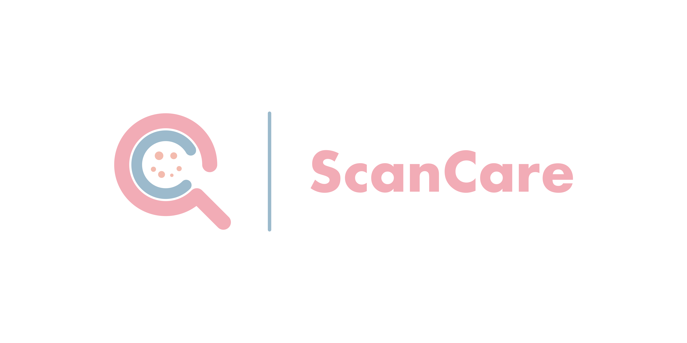

# ScanCare-machine-learning



Scancare is an innovative skincare app that leverages the power of machine learning and Flask to provide personalized skincare recommendations. By scanning your face, Scancare can detect various skin conditions and recommend products that are best suited for your skin type. 

## Built for Bangkit 2023 Batch 1 Capstone Project
This project serves as the capstone project for the Bangkit 2023 Batch 1 program.

## Features

- Facial scan for skin analysis
- Personalized skincare product recommendations
- Machine learning algorithms for accurate detection and analysis
- Google Cloud Platform integration for robust API management

## Getting Started

These instructions will guide you on how to set up and run the Scancare Flask application locally.

### Prerequisites
```bash
- python==3.9.11
```

### Installing and Running
Follow the steps below to deploy the Scancare Flask application locally:

1. Clone this repository.
```bash
git clone https://github.com/ScanCare-C23-PS023/ScanCare-machine-learning.git
```
2. Navigate to the project directory.
```bash
cd Scancare
```
3. Create a virtual environment (optional but recommended).
```bash
python -m venv venv
source venv/bin/activate
```
4. Install the required Python packages.
```bash
Install the required Python packages.
```
5. For the model refer to
```bash
https://github.com/ScanCare-C23-PS023/ScanCare-Modeling
```

6. Start the Flask application.
```bash
python main.py
```
7. Access the application by visiting http://localhost:5000/predict in postman.

## Authors
- Ilham Zakariya - Mobile Development - [Maxisud](https://github.com/Maxisud)
- Muhammad Eri Setyawan - Machine Learning Development - [EriSetyawan166](https://github.com/EriSetyawan166)
- Muhammad Syawaladi Kukuh. P - Machine Learning Development - [Swal27](https://github.com/Swal27)
- Ikhsan - Machine Learning Development - Ikhsan
- Mohammad Syauqil Amin - Cloud Computing - [MohammadSyauqilAmin](https://github.com/MohammadSyauqilAmin)
- Wimar Abdurrachman - Cloud Computing - [wimarar](https://github.com/wimarar)


## License

This project is licensed under the MIT License - see the [LICENSE.md](LICENSE) file for details

## Acknowledgments

We would like to express our gratitude to the following:

- The Bangkit 2023 Batch 1 program, for providing us the opportunity and platform to develop this project. This experience has been instrumental in our growth and learning.
  
- Our mentors and instructors, for their invaluable guidance and expertise. Your dedication and encouragement have inspired us to push our boundaries.

- TensorFlow and the Google Cloud Platform teams, for developing and maintaining these powerful tools that have been critical in the creation of Scancare.

- Our users and the open-source community, for their support and contributions. Your feedback and involvement have been vital in improving Scancare.

- Lastly, we would like to acknowledge all those who have indirectly contributed to this project. Your work has made a difference.

Thank you for your support and belief in Scancare. We look forward to continuing our journey in enhancing skincare through technology.
